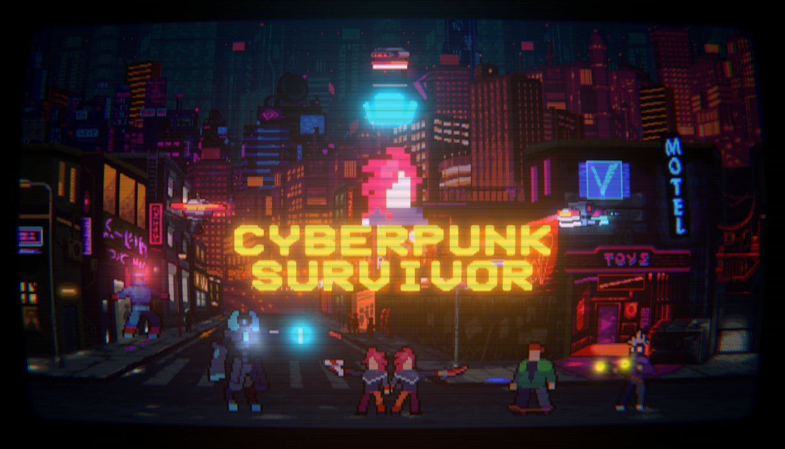
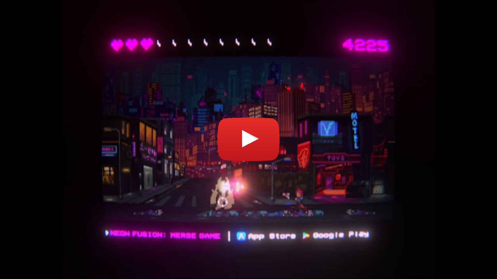

# Cyberpunk Survivor

    <a href="README.md">Türkçe</a>
    ·
    <a href="README_EN.md">English</a>

### Cyberpunk Survivor - Steam: [https://store.steampowered.com/app/4866450/Cyberpunk_Survivor/](https://store.steampowered.com/app/4866450/Cyberpunk_Survivor/)
*Bağımsız **mrtcnbykl** geliştirici kimliğini kullanarak geliştirmiş olduğum **Cyberpunk Survivor** adlı oyun, 21 Eylül 2026 tarihinde Steam'de yayımlanmıştır.*

 

*Cyberpunk Survivor*, eski tür atari oyunlarından esinlenen sanat tasarımı ve oynanış biçimiyle, Unity Oyun Motoru üzerinden C# programlama dili kullanılarak geliştirilmiştir. 

- Oyunun sanat tasarımları, sanatçıların kamuya açık biçimde paylaştıkları çalışmaları ve kendi tasarımlarımın birleşimiyle oluşturulmuştur.
- Oyunun programlaması, düşünüp tasarlama ve araştırıp uygulama döngüsü içerisinde yapılmıştır.
- Tasarım ve programlama süreçlerinde, üretken yapay anlak kullanımından kaçınılmıştır.

 

##### *Aşağıdaki görsele tıklayarak, Cyberpunk Survivor tanıtım videosunu YouTube üzerinden izleyebilirsiniz.*

      

## *mrtcnbykl*
*[mrtcnbykl](https://github.com/mertcanbaykal/mrtcnbykl) bağlantısı ile öteki çalışmalarıma ulaşabilirsiniz.*
